## ..................... **MERN STACK IMPLEMENTATION**......................
## This project shows how to implement MERN STACK**(MongoDB-Expressjs-Reactjs-Nodejs) on AWS

# ........................BACKEND CONFIGURATION...........................
Update the ubuntu server

`sudo apt update`

Upgrade  Ubuntu

`sudo apt upgrade`

Install the node js repo [Nodejs distribution](https://github.com/nodesource/distributions#deb)

`curl -fsSL https://deb.nodesource.com/setup_18.x | sudo -E bash -`

Install Node.js

`sudo apt-get install nodejs -y`

This also installs NPM which is a package manager for Node like apt for Ubuntu, it is used to install Node modules & packages and to manage dependency conflicts.

Verify the node installation with the command below.

`node -v`

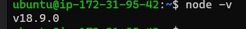


Verify the npm installation with the command below

`npm -v`

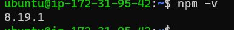


#.....................Application Code Setup.......................

Lets create a new directory for our Todo application.

`mkdir Todo`

Now change the current directory to the newly created one:

`cd Todo`

Next, we will initialise our project, so that a new file named package.json will be created. This file will normally contain information about our application and the dependencies that it needs to run.

`npm init`
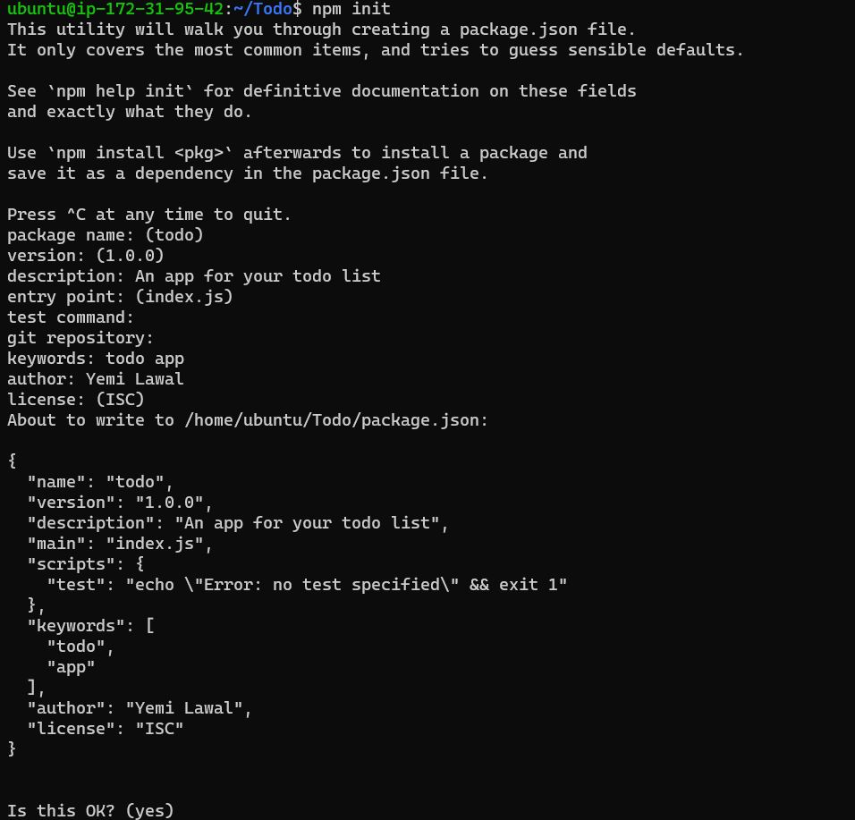

Lets run the `ls` command to view the file created. 
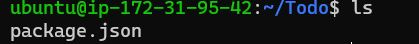


## ..............INSTALL EXPRESSJS.........................
---
 Express is a framework for Node.js, it simplifies development, and abstracts a lot of low level details. For example, Express helps to define routes of your application based on HTTP methods and URLs.

 Install express using the Node Package Manager NPM.

 `npm install express`

 Create a file index.js with the command below

 `touch index.js`

 Install the dotenv module

`npm install dotenv`

Open the index.js file with the command `vim index.js` then copy and paste the below script.

```
const express = require('express');
require('dotenv').config();

const app = express();

const port = process.env.PORT || 5000;

app.use((req, res, next) => {
res.header("Access-Control-Allow-Origin", "\*");
res.header("Access-Control-Allow-Headers", "Origin, X-Requested-With, Content-Type, Accept");
next();
});

app.use((req, res, next) => {
res.send('Welcome to Express');
});

app.listen(port, () => {
console.log(`Server running on port ${port}`)
});
```

Exit and lets start the Express server, run `node index.js` 

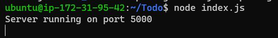

Notice the port running is 5000, this was specified in the index.js script copied earlier.

Open up your browser and try to access your server’s Public IP or Public DNS name followed by port 5000:

`http://<PublicIP-or-PublicDNS>:5000`

The webpage should display a `Welcome to Express` message as shown below.


## ..............................Route.............................
---

There are three actions that our To-Do application needs to be able to do:

- [x] Create a new task
- [x] Display list of all tasks
- [x] Delete a completed task

Each task will be associated with some particular endpoint and will use different standard HTTP request methods: POST, GET, DELETE.

For each task, we need to create routes that will define various endpoints that the To-do app will depend on. So let us create a folder routes

`mkdir routes`

Enter the routes folder and create a file called api.js

`cd routes; touch api.js`

Open the file with the command `vim api.js` copy and paste the below command.

```
const express = require ('express');
const router = express.Router();

router.get('/todos', (req, res, next) => {

});

router.post('/todos', (req, res, next) => {

});

router.delete('/todos/:id', (req, res, next) => {

})

module.exports = router;
```

## ..................Creating Models.........................

Change directory back Todo folder with cd .. and install Mongoose

`npm install mongoose`

Create a new folder models :

`mkdir models`

Change directory into the newly created ‘models’ folder and create a file called todo.js

`cd models ; touch todo.js`

open the todo.js file and paste the below command.

```
const mongoose = require('mongoose');
const Schema = mongoose.Schema;

//create schema for todo
const TodoSchema = new Schema({
action: {
type: String,
required: [true, 'The todo text field is required']
}
})

//create model for todo
const Todo = mongoose.model('todo', TodoSchema);

module.exports = Todo;
```
Now we need to update our routes from the file api.js in ‘routes’ directory to make use of the new model.

In Routes directory, open api.js with vim api.js, delete the code inside with :%d command and paste there code below into it then save and exit

```
const express = require ('express');
const router = express.Router();
const Todo = require('../models/todo');

router.get('/todos', (req, res, next) => {

//this will return all the data, exposing only the id and action field to the client
Todo.find({}, 'action')
.then(data => res.json(data))
.catch(next)
});

router.post('/todos', (req, res, next) => {
if(req.body.action){
Todo.create(req.body)
.then(data => res.json(data))
.catch(next)
}else {
res.json({
error: "The input field is empty"
})
}
});

router.delete('/todos/:id', (req, res, next) => {
Todo.findOneAndDelete({"_id": req.params.id})
.then(data => res.json(data))
.catch(next)
})

module.exports = router;
```

## .............................MONGODB DATABASE..............................
---
we will make use of **mLab**. it provides MongoDB database as a service solution (DBaaS), you will need to sign up for a shared clusters free account, which is ideal for our use case. [Sign up here.](https://www.mongodb.com/atlas-signup-from-mlab) Follow the sign up process, select `AWS` as the cloud provider, and choose a region near you.

Complete a get started checklist as shown on the image below

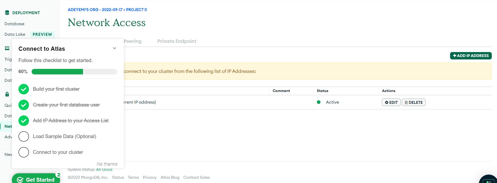


Create a MongoDB database and collection inside mLab, `click on add your own data`

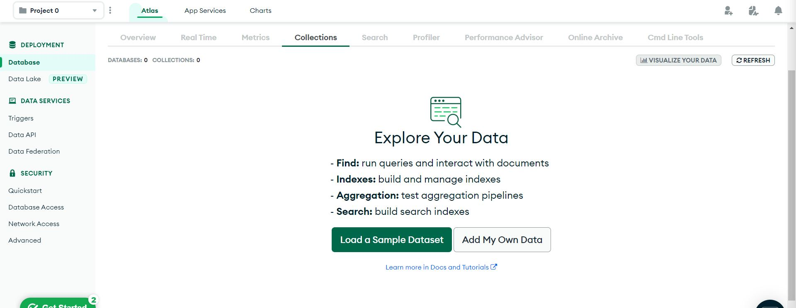

We will create a .env file to access environment variables.

Create a file in the Todo directory and name it .env:  `vi.env` open and add the connection string to access the database in it, just as below:

`DB = 'mongodb+srv://<username>:<password>@<network-address>/<dbname>?retryWrites=true&w=majority'`

follow the screenshots below to get the connection string.

 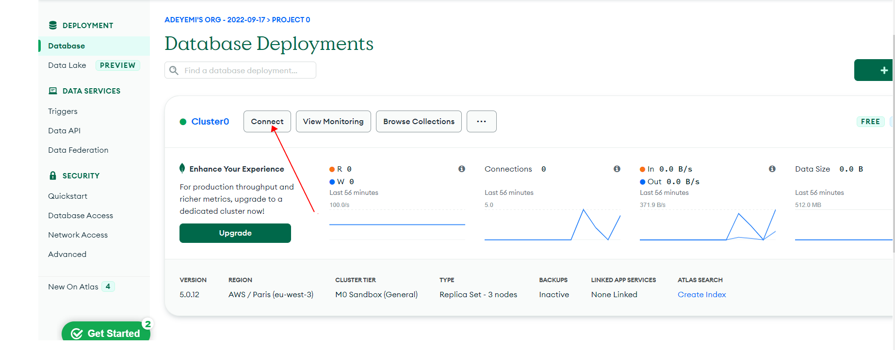
 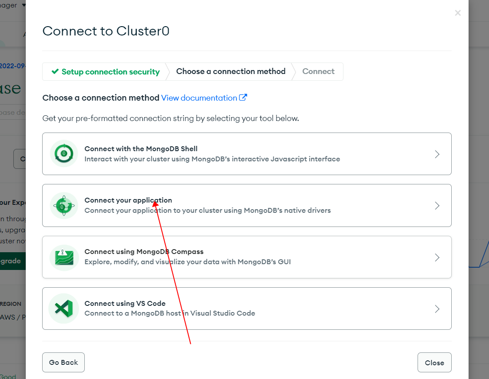

 Now we need to update the index.js to reflect the use of .env so that Node.js can connect to the database.

 Open the file with `vim index.js` and type `:%d` to delete contents of the file. paste the below code in the file.

 ```
const express = require('express');
const bodyParser = require('body-parser');
const mongoose = require('mongoose');
const routes = require('./routes/api');
const path = require('path');
require('dotenv').config();

const app = express();

const port = process.env.PORT || 5000;

//connect to the database
mongoose.connect(process.env.DB, { useNewUrlParser: true, useUnifiedTopology: true })
.then(() => console.log(`Database connected successfully`))
.catch(err => console.log(err));

//since mongoose promise is depreciated, we overide it with node's promise
mongoose.Promise = global.Promise;

app.use((req, res, next) => {
res.header("Access-Control-Allow-Origin", "\*");
res.header("Access-Control-Allow-Headers", "Origin, X-Requested-With, Content-Type, Accept");
next();
});

app.use(bodyParser.json());

app.use('/api', routes);

app.use((err, req, res, next) => {
console.log(err);
next();
});

app.listen(port, () => {
console.log(`Server running on port ${port}`)
});
```
Start the server using the command:

`node index.js`

The outcome should be successful connection to the database.

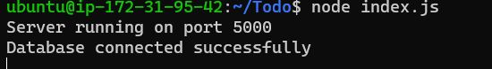

## ......................Testing Backend Code without Frontend using RESTful API ........................
---


Test all the API endpoints and make sure they are working.
Now lets open Postman, create a POST request to the API `http://<PublicIP-or-PublicDNS>:5000/api/todos`. This request sends a new task to our To-Do list so the application could store it in the database.

**Note:** make sure your set header key Content-Type as application/json.

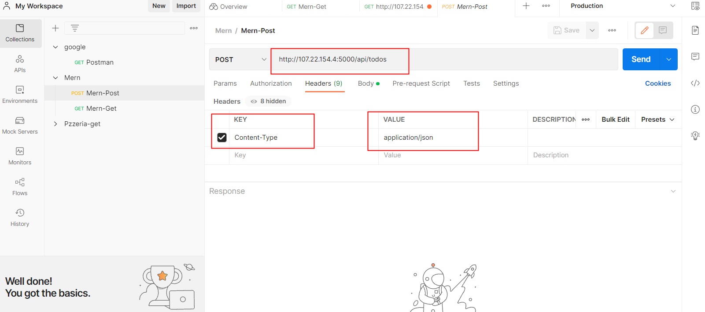

We also create a GET request to the API on `http://<PublicIP-or-PublicDNS>:5000/api/todos`. this will retrive all the existing records from the database.

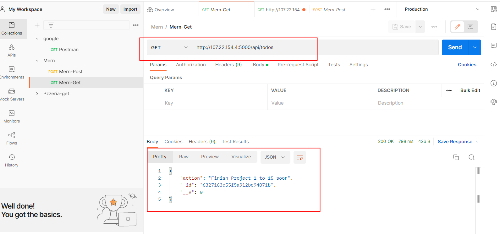

We can test the DELETE endpoint by appending the `id` of the task to the url as fown below.

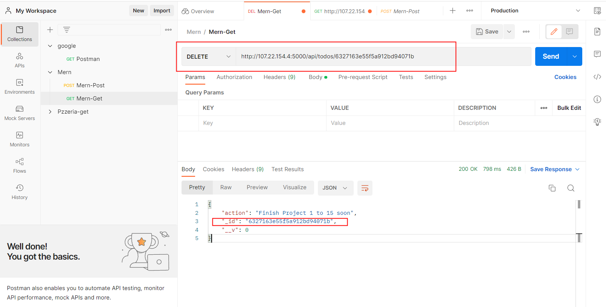

so at this stage we have tested the backend operation of out todo application and can confirm that it supports all 3 operations.

- [x] Display a list of tasks – HTTP GET request
- [x] Add a new task to the list – HTTP POST request
- [x] Delete an existing task from the list – HTTP DELETE request

## ......................FRONTEND CREATION...................................
---


 To start out with the frontend of the To-do app, we will use the create-react-app command to scaffold our app.

 In the same root directory as your backend code, which is the Todo directory, run the below code to create a new directory called `client` where we will add the react code.

 ` npx create-react-app client`

 We will Install a program called concurrently. which is used to run more than one command simultaneously from the same terminal window.

 `npm install concurrently --save-dev`

 We will also install `nodeman` to run and monitor the server. If there is any change in the server code, nodemon will restart it automatically and load the new changes.

 `npm install nodemon --save-dev`

 Lets go to the todo folder on our app and open the `package.json file` and replace the `script` section with the below code.

 ```
"scripts": {
"start": "node index.js",
"start-watch": "nodemon index.js",
"dev": "concurrently \"npm run start-watch\" \"cd client && npm start\""
},
```
The `package.json script` section should look like the below.

 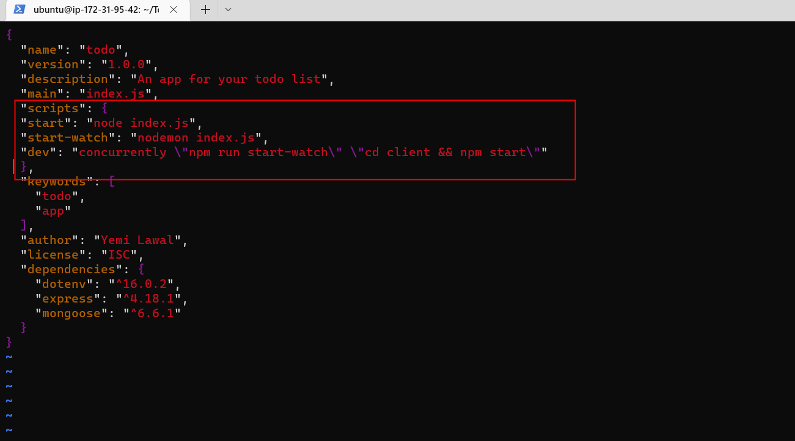


Next, let's configure the proxy in the package.json file

`cd client ; vi package.json`

We will add the key value pair in the package.json file `"proxy": "http://localhost:5000" ` as shown below.

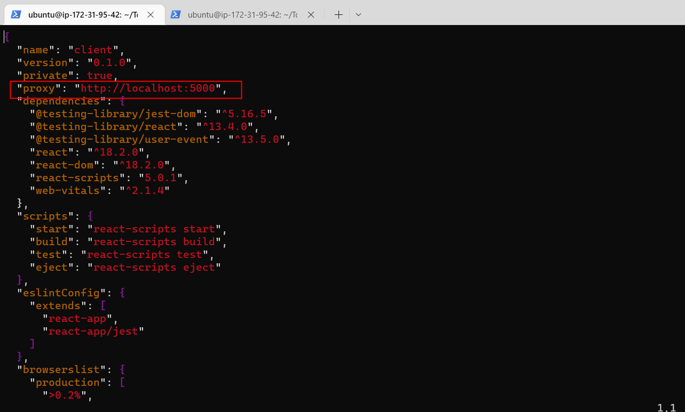

This will enable us access the application directly from the browser by simply calling the server url like `http://localhost:5000 `rather than always including the entire path like `http://localhost:5000/api/todos`

Now run `npm run dev` inside the `Todo` directory.
we can access the app on our browser on `localhost:3000`

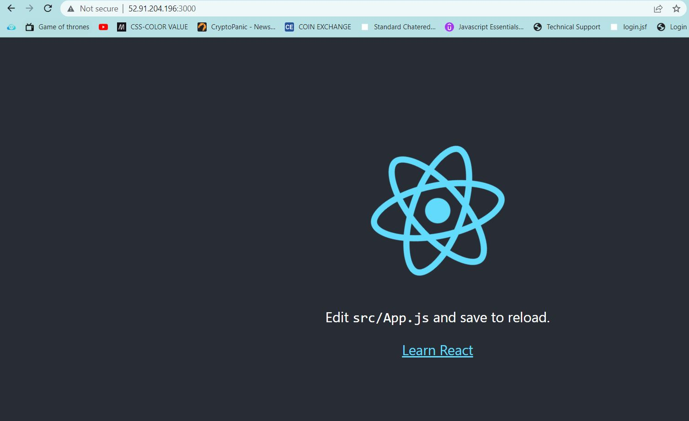

**<span style="color:red"> Note !!</span>** I allowed all traffic on my security group, this is not a good practice but it's okay for this project so i dont have to be allowing ports manually. you need to allow port 3000 on your security group for the app to work if you have not done that.

For our Todo app, there will be two stateful components and one stateless component.
Run `cd client` from the `Todo` directory, move to `cd src` directory and create a new directory called `mkdir components`.

Inside ‘components’ directory create three files `Input.js`,` ListTodo.js` and `Todo.js`.

`touch Input.js ListTodo.js Todo.js`

Open Input.js file `vi Input.js` then copy and paste the below code.

```
import React, { Component } from 'react';
import axios from 'axios';

class Input extends Component {

state = {
action: ""
}

addTodo = () => {
const task = {action: this.state.action}

    if(task.action && task.action.length > 0){
      axios.post('/api/todos', task)
        .then(res => {
          if(res.data){
            this.props.getTodos();
            this.setState({action: ""})
          }
        })
        .catch(err => console.log(err))
    }else {
      console.log('input field required')
    }

}

handleChange = (e) => {
this.setState({
action: e.target.value
})
}

render() {
let { action } = this.state;
return (
<div>
<input type="text" onChange={this.handleChange} value={action} />
<button onClick={this.addTodo}>add todo</button>
</div>
)
}
}

export default Input
```

Move out of the directory to the clients directory `cd ../..` and install Axios `npm install axios`

Move to the components directory `cd src/components` and open the  ListTodo.js file `vi ListTodo.js`

copy and paste the below into the file.

```
import React from 'react';

const ListTodo = ({ todos, deleteTodo }) => {

return (
<ul>
{
todos &&
todos.length > 0 ?
(
todos.map(todo => {
return (
<li key={todo._id} onClick={() => deleteTodo(todo._id)}>{todo.action}</li>
)
})
)
:
(
<li>No todo(s) left</li>
)
}
</ul>
)
}

export default ListTodo
```
Open the Todo.js file then copy and paste the below code.

```
import React, {Component} from 'react';
import axios from 'axios';

import Input from './Input';
import ListTodo from './ListTodo';

class Todo extends Component {

state = {
todos: []
}

componentDidMount(){
this.getTodos();
}

getTodos = () => {
axios.get('/api/todos')
.then(res => {
if(res.data){
this.setState({
todos: res.data
})
}
})
.catch(err => console.log(err))
}

deleteTodo = (id) => {

    axios.delete(`/api/todos/${id}`)
      .then(res => {
        if(res.data){
          this.getTodos()
        }
      })
      .catch(err => console.log(err))

}

render() {
let { todos } = this.state;

    return(
      <div>
        <h1>My Todo(s)</h1>
        <Input getTodos={this.getTodos}/>
        <ListTodo todos={todos} deleteTodo={this.deleteTodo}/>
      </div>
    )

}
}

export default Todo;
```

Let's move out of the components folder back to the src folder `cd ..`.

Open the `App,js` file and paste the below code.

```
import React from 'react';

import Todo from './components/Todo';
import './App.css';

const App = () => {
return (
<div className="App">
<Todo />
</div>
);
}

export default App;
```

Save and exit the editor `:wq`
Open the App.css file, delete the script and then copy and paste the below file.

```
.App {
text-align: center;
font-size: calc(10px + 2vmin);
width: 60%;
margin-left: auto;
margin-right: auto;
}

input {
height: 40px;
width: 50%;
border: none;
border-bottom: 2px #101113 solid;
background: none;
font-size: 1.5rem;
color: #787a80;
}

input:focus {
outline: none;
}

button {
width: 25%;
height: 45px;
border: none;
margin-left: 10px;
font-size: 25px;
background: #101113;
border-radius: 5px;
color: #787a80;
cursor: pointer;
}

button:focus {
outline: none;
}

ul {
list-style: none;
text-align: left;
padding: 15px;
background: #171a1f;
border-radius: 5px;
}

li {
padding: 15px;
font-size: 1.5rem;
margin-bottom: 15px;
background: #282c34;
border-radius: 5px;
overflow-wrap: break-word;
cursor: pointer;
}

@media only screen and (min-width: 300px) {
.App {
width: 80%;
}

input {
width: 100%
}

button {
width: 100%;
margin-top: 15px;
margin-left: 0;
}
}

@media only screen and (min-width: 640px) {
.App {
width: 60%;
}

input {
width: 50%;
}

button {
width: 30%;
margin-left: 10px;
margin-top: 0;
}
}
```
In the src directory open the index.css `vi index.css` and paste the below code, remember to delete the existing code with the command `:%d`

```
body {
margin: 0;
padding: 0;
font-family: -apple-system, BlinkMacSystemFont, "Segoe UI", "Roboto", "Oxygen",
"Ubuntu", "Cantarell", "Fira Sans", "Droid Sans", "Helvetica Neue",
sans-serif;
-webkit-font-smoothing: antialiased;
-moz-osx-font-smoothing: grayscale;
box-sizing: border-box;
background-color: #282c34;
color: #787a80;
}

code {
font-family: source-code-pro, Menlo, Monaco, Consolas, "Courier New",
monospace;
}
```
Lets go back to the `Todo` directory with the command `cd ../.. `and run the command `npm run dev`

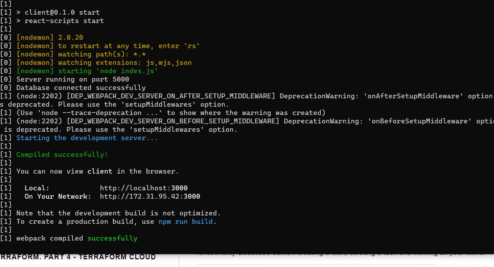

After successful completeion of the process, you can view the application on the browser by going to the url `localhost:3000` or using the public-ip address of the server and port 3000. `public-ip-address:3000`

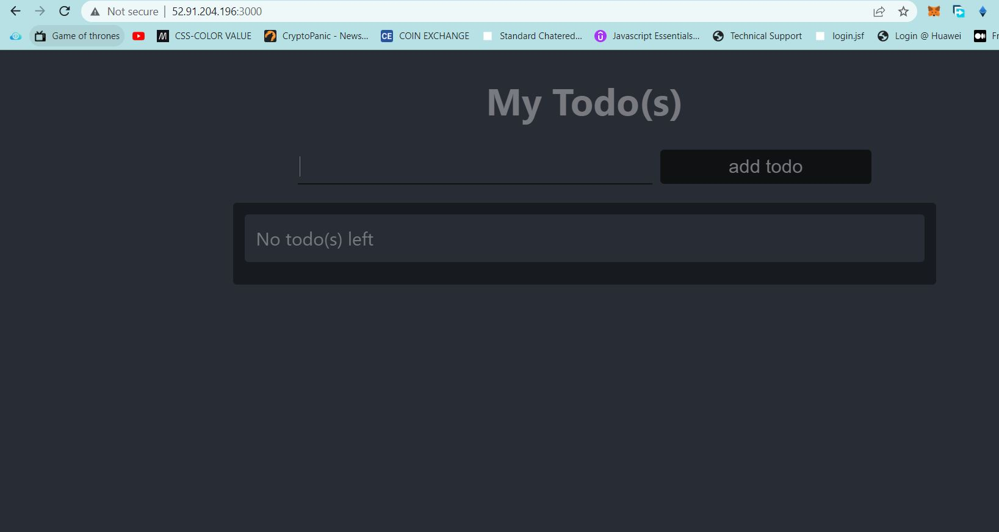

Now you can create a list of your Todo, view them in the database and delete them as well using the App.